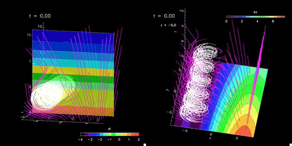
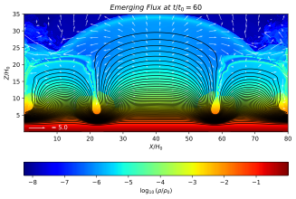
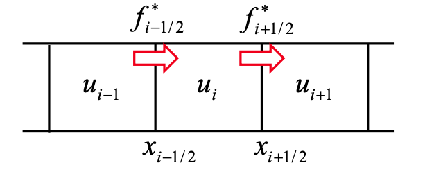
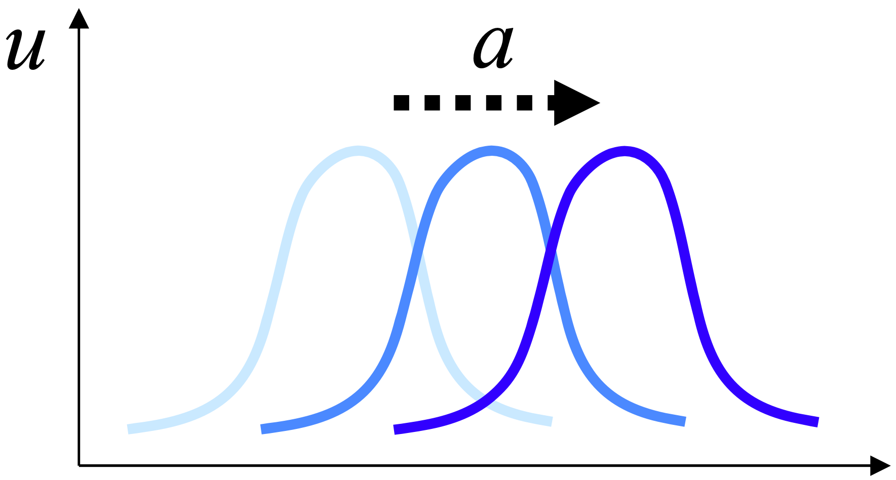
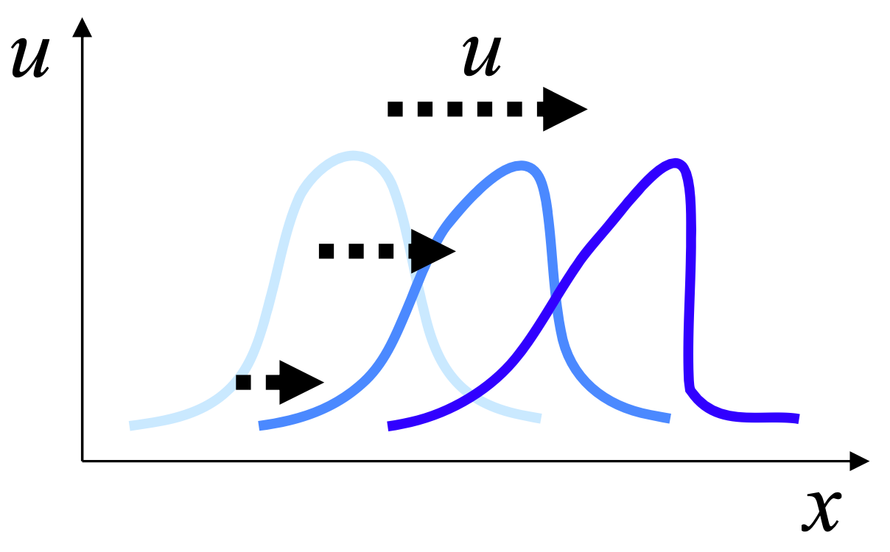
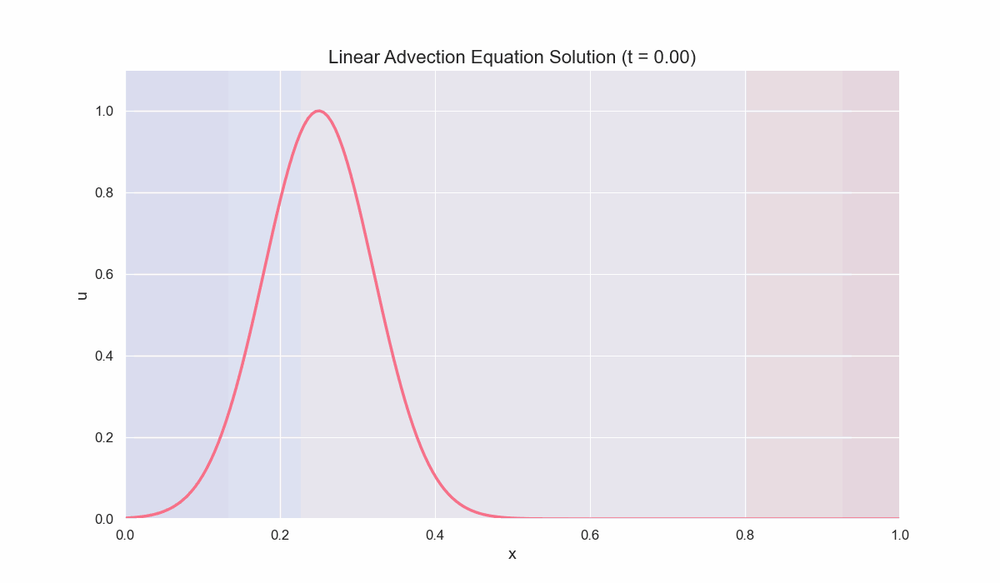
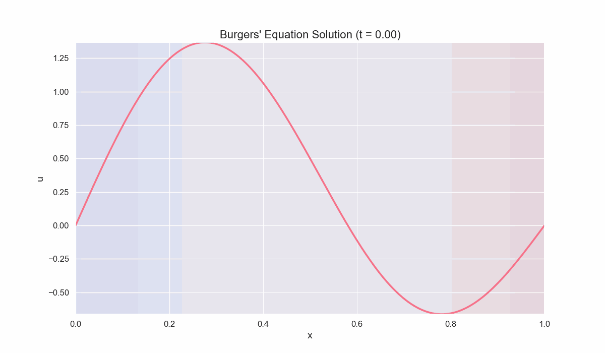
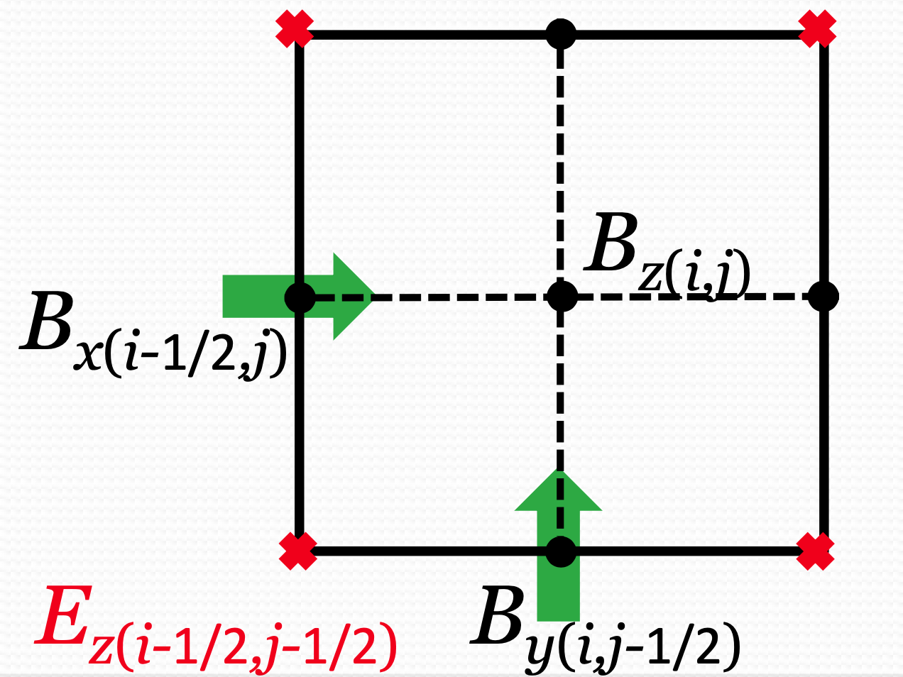

# Numerical Methods for MHD Equations

**Donghui Son**  
Ph.D. Student, School of Space Research, Kyung Hee University  
October 3rd, 2024  
Solar Dynamics Laboratory

---

<div style="text-align: center;">
  
</div>

---

<h2 style="text-align: center; color: #333; margin-bottom: 20px; font-size: 40px;">AD - Solar Dynamics Lab (Prof. Tetsuya Magara)</h2>

<div style="display: flex; justify-content: center; align-items: stretch; gap: 30px; margin-bottom: 20px;">
  <div style="width: 300px; text-align: center; box-shadow: 0 4px 8px rgba(0,0,0,0.1); padding: 10px; border-radius: 8px;">
    <div style="height: 200px; margin-bottom: 10px;">
      
    </div>
    <p style="font-size: 14px; color: #444; margin: 0;">Shock wave produced by emerging flux</p>
  </div>
  <div style="width: 400px; text-align: center; box-shadow: 0 4px 8px rgba(0,0,0,0.1); padding: 10px; border-radius: 8px;">
    <div style="height: 200px; margin-bottom: 10px;">
      
    </div>
    <p style="font-size: 14px; color: #444; margin: 0;">Solar penumbral microjet</p>
  </div>
  <div style="width: 300px; text-align: center; box-shadow: 0 4px 8px rgba(0,0,0,0.1); padding: 10px; border-radius: 8px;">
    <div style="height: 200px; margin-bottom: 10px;">
      
    </div>
    <p style="font-size: 14px; color: #444; margin: 0;">Parker Instability</p>
  </div>
</div>

<div style="text-align: left; margin-top: 5px;">
  <h3 style="color: #333; margin-bottom: 15px;">Research Focus</h3>
  <ul style="list-style-type: disc; padding-left: 40px;">
    <li style="margin-bottom: 10px; padding-left: 10px;">
      <span style="display: block; margin-left: -10px;">Conducting advanced numerical simulations to investigate complex solar phenomena</span>
    </li>
    <li style="margin-bottom: 10px; padding-left: 10px;">
      <span style="display: block; margin-left: -10px;">Utilizing state-of-the-art computational resources, including a high-performance local cluster capable of parallel processing with 512 cores</span>
    </li>
    <li style="padding-left: 10px;">
      <span style="display: block; margin-left: -10px;">Developing and applying sophisticated MHD models to study solar interior and solar exterior</span>
    </li>
  </ul>
</div>

---

## Objectives

1. **Understand the fundamentals of Magnetohydrodynamics (MHD).**
2. **Understand finite difference and finite volume methods for solving MHD eqs.**
3. **Effectively handle discontinuous solutions in MHD simulations.**

---

## Contents

1. Introduction to MHD
2. MHD Equations and Their Properties
3. Numerical Methods for MHD
4. Solution Techniques for Scalar Equations
5. Riemann Solvers and Solutions for System Equations
6. Advanced Topics and Practical Implementation
7. Future Challenges and Conclusion

---

## 1. Introduction to MHD

---

### 1.1 Why Study Computational MHD?

- **Understanding Space and Astrophysical Phenomena:**
  - Solar flares, coronal mass ejections, astrophysical jets, accretion disks.
- **Crucial in Extreme Conditions:**
  - High Mach number flows.
  - Large density and pressure variations.
  - Strong fluid and magnetic field interactions.
  - Relativistic effects.
- **Applications:**
  - Fusion plasma confinement.
  - Astrophysical simulations.

> **Note:** MHD discontinuities, such as shocks and current sheets, are ubiquitous in astrophysical plasmas!

---

## 2. MHD Equations and Their Properties

### 2.1 Basic MHD Equations

The ideal MHD equations consist of a set of nonlinear partial differential equations that describe the macroscopic behavior of a conducting fluid in the presence of a magnetic field.

---

1. **Continuity Equation (Mass Conservation):**

   $$
   \frac{\partial \rho}{\partial t} + \nabla \cdot (\rho \mathbf{v}) = 0
   $$

---

2. **Momentum Equation (Conservation of Momentum):**

   $$
   \rho \frac{D \mathbf{v}}{D t} = -\nabla p + \mathbf{J} \times \mathbf{B}
   $$

   - **Material Derivative (Lagrangian perspective):**

     $$
     \frac{D \mathbf{v}}{D t} = \frac{\partial \mathbf{v}}{\partial t} + (\mathbf{v} \cdot \nabla) \mathbf{v}
     $$

   - **Eulerian vs. Lagrangian Derivatives:**

     - **Eulerian (fixed point in space):**
       $$
       \frac{\partial \mathbf{v}}{\partial t}
       $$
     - **Lagrangian (following fluid particle):**
       $$
       \frac{D \mathbf{v}}{D t}
       $$

---

3. **Energy Equation (Conservation of Energy):**

   $$
   \frac{\partial E}{\partial t} + \nabla \cdot \left[ \left( E + p + \frac{B^2}{2\mu_0} \right) \mathbf{v} - \frac{1}{\mu_0} (\mathbf{v} \cdot \mathbf{B}) \mathbf{B} \right] = 0
   $$

   - **Total Energy Density:**

     $$
     E = \rho e + \frac{1}{2} \rho v^2 + \frac{B^2}{2\mu_0}
     $$

---

4. **Magnetic Induction Equation (Faraday's Law without Displacement Current):**

   $$
   \frac{\partial \mathbf{B}}{\partial t} = \nabla \times (\mathbf{v} \times \mathbf{B})
   $$

   <br>

5. **Divergence-Free Condition (Gauss's Law for Magnetism):**

   $$
   \nabla \cdot \mathbf{B} = 0
   $$

   <br>

6. **Equation of State (Ideal Gas Law):**

   $$
   p = (\gamma - 1) \rho e
   $$

   - Alternatively:

     $$
     e = \frac{p}{(\gamma - 1) \rho}
     $$

---

**Variables:**

- $\rho$ : Mass density.
- $\mathbf{v}$ : Fluid velocity vector.
- $p$ : Pressure.
- $e$ : Specific internal energy (per unit mass).
- $\mathbf{B}$ : Magnetic field vector.
- $\mathbf{J}$ : Current density, given by:

  $$
  \mathbf{J} = \frac{1}{\mu_0} \nabla \times \mathbf{B}
  $$

- $\gamma$ : Ratio of specific heats (adiabatic index).
- $\mu_0$ : Permeability of free space.

---

### 2.2 MHD Waves

The MHD equations support different types of wave modes due to the coupling between the fluid and magnetic field.

---

1. **Alfvén Waves:**

   - **Alfvén Speed:**

     $$
     v_A = \frac{B}{\sqrt{\mu_0 \rho}}
     $$

   - **Characteristics:**
     - Transverse, incompressible waves.
     - Magnetic tension acts as the restoring force.
     - Propagate along magnetic field lines.

---

2. **Magnetosonic Waves:**

- **Fast Magnetosonic Waves:**

  - **Speed:**

  $$
  c_f = \sqrt{\frac{1}{2} \left( c_s^2 + v_A^2 + \sqrt{(c_s^2 + v_A^2)^2 - 4 c_s^2 v_{A}^2 \cos^2 \theta} \right)}
  $$

  - **Characteristics:**

    - Compressible waves.
    - Can propagate in any direction.
    - Fastest MHD wave mode.
    - Combines properties of sound waves and Alfvén waves.

---

- **Slow Magnetosonic Waves:**

  - **Speed:**

    $$
    c_s = \sqrt{\frac{1}{2} \left( c_s^2 + v_A^2 - \sqrt{(c_s^2 + v_A^2)^2 - 4 c_s^2 v_{A}^2 \cos^2 \theta} \right)}
    $$

  - **Characteristics:**
    - Compressible waves.
    - Propagate primarily along magnetic field lines.
    - Slowest MHD wave mode.
    - Involve both magnetic and gas pressure perturbations.

---

- **Variables:**

  - $c_s$ : Sound speed.

    $$
    c_s = \sqrt{\frac{\gamma p}{\rho}}
    $$

  - $\theta$ : Angle between the wave propagation direction and the magnetic field.

---

### 2.3 Conservation Form of MHD Equations

The MHD equations can be written in the conservation form:

$$
\frac{\partial U}{\partial t} + \nabla \cdot \mathbf{F}(U) = 0
$$

---

- **Conserved Variables ($U$):**

  $$
  U = \begin{pmatrix}
  \rho \\
  \rho \mathbf{v} \\
  E \\
  \mathbf{B}
  \end{pmatrix}
  $$

- **Flux Functions ($\mathbf{F}(U)$):**

  $$
  \mathbf{F}(U) = \begin{pmatrix}
  \rho \mathbf{v} \\
  \rho \mathbf{v} \otimes \mathbf{v} + \left( p + \frac{B^2}{2\mu_0} \right) \mathbf{I} - \frac{1}{\mu_0} \mathbf{B} \otimes \mathbf{B} \\
  \left( E + p + \frac{B^2}{2\mu_0} \right) \mathbf{v} - \frac{1}{\mu_0} (\mathbf{v} \cdot \mathbf{B}) \mathbf{B} \\
  \mathbf{v} \otimes \mathbf{B} - \mathbf{B} \otimes \mathbf{v}
  \end{pmatrix}
  $$

  - $\mathbf{I}$ : Identity matrix.
  - The symbol $\otimes$ denotes the tensor (outer) product.

---

## 3. Numerical Methods for MHD

### 3.1 Finite Difference Methods

Finite difference methods **approximate derivatives** using discrete differences across grid points.

<div style="text-align: center;">
  
</div>

---

For example, the first-order derivative can be approximated as:

- **Forward Difference:**

  $$
  (\frac{\partial u}{\partial x})_{i} \approx \frac{u_{i+1} - u_i}{\Delta x}
  $$

- **Backward Difference:**

  $$
  (\frac{\partial u}{\partial x})_{i} \approx \frac{u_i - u_{i-1}}{\Delta x}
  $$

- **Central Difference:**

  $$
  (\frac{\partial u}{\partial x})_{i} \approx \frac{u_{i+1} - u_{i-1}}{2 \Delta x}
  $$

---

### 3.2 Finite Volume Methods

Finite Volume Methods (FVM) are widely used for solving conservation laws, particularly for hyperbolic partial differential equations like the MHD equations.

---

#### 3.2.1 Introduction to Finite Volume Methods

- **Idea:** Divide the computational domain into discrete control volumes (cells) and apply the integral form of the conservation laws to each cell.

<div style="text-align: center;">
  
</div>

---

- **Conservation Law in Integral Form:**

  $$
  \frac{\partial}{\partial t} \int_{V_i} U \, dV + \int_{\partial V_i} \mathbf{F}(U) \cdot \mathbf{n} \, dS = 0
  $$

  - $V_i$ : Volume of the $i$-th cell.
  - $\partial V_i$ : Boundary of the $i$-th cell.
  - $\mathbf{n}$ : Outward normal vector to the cell surface.

---

#### 3.2.2 Discretization in Finite Volume Methods

- **Cell-Averaged Values:**

  $$
  \bar{U}_i = \frac{1}{V_i} \int_{V_i} U \, dV
  $$

- **Semi-Discrete Formulation:**

  $$
  \frac{d \bar{U}_i}{d t} = -\frac{1}{V_i} \sum_{faces} \left( \int_{face} \mathbf{F}(U) \cdot \mathbf{n} \, dS \right)
  $$

---

- **One-Dimensional Case:**

  For uniform grid spacing $\Delta x$, the update formula simplifies to:

  $$
  \frac{d \bar{U}_i}{d t} = -\frac{1}{\Delta x} \left( F_{i+\frac{1}{2}} - F_{i-\frac{1}{2}} \right)
  $$

  - $F_{i+\frac{1}{2}}$ : Numerical flux at the interface between cells $i$ and $i+1$.

---

#### 3.2.3 Computing Numerical Fluxes

- **Godunov's Method:**

  - Uses exact or approximate Riemann solvers to compute the fluxes at cell interfaces.
  - **Riemann Problem at Cell Interfaces:**
    - Left state $U_L = \bar{U}_i$
    - Right state $U_R = \bar{U}_{i+1}$

- **Approximate Riemann Solvers:**

  - **Roe Solver**
  - **HLL Solver**
  - **HLLC Solver**
  - **HLLD Solver (for MHD)**

---

- **Flux Computation:**

  $$
  F_{i+\frac{1}{2}} = F(U_L, U_R)
  $$

  - The flux $F_{i+\frac{1}{2}}$ depends on the solution of the Riemann problem between $U_L$ and $U_R$.

---

#### 3.2.4 Advantages of Finite Volume Methods

- **Conservation:** Ensure conservation of physical quantities at the discrete level.
- **Handling Discontinuities:** Naturally handle shocks and discontinuities.
- **Flexibility:** Applicable to complex geometries and unstructured grids.

---

#### 3.2.5 Application to MHD Equations

- **Conservation Variables:** Use the conserved variables $U$ in the finite volume formulation.
- **Fluxes:** Compute the fluxes $\mathbf{F}(U)$ at the cell interfaces using appropriate Riemann solvers.
- **Divergence Constraint:** Special care must be taken to maintain $\nabla \cdot \mathbf{B} = 0$.

---

## 4. Solution Techniques for Scalar Equations

### 4.1 Linear Advection Equation

The linear advection equation models the transport of a quantity $u(x, t)$ at a constant speed $a$:

$$
\frac{\partial u}{\partial t} + a \frac{\partial u}{\partial x} = 0, \quad a > 0 \ (const)
$$

This equation describes how a wave profile moves without changing its shape, which is essential in modeling phenomena like sound waves.

---

### Analytical Solution

The analytical solution is:

$$
u(x, t) = u_0(x - a t)
$$

where $u_0(x)$ is the initial condition at $t = 0$.

<div style="text-align: center;">
  
</div>

---

### Numerical Methods

- **Upwind Scheme:**
  The upwind scheme is tailored to the direction of wave propagation:

  $$
  u_i^{n+1} = u_i^n - \frac{a \Delta t}{\Delta x} (u_i^n - u_{i-1}^n)
  $$

  ```python
  def upwind_scheme(u, a, dt, dx):
      return u[1:-1] - (a * dt / dx) * (u[1:-1] - u[:-2])
  ```

- **Stability Condition:**
  To ensure numerical stability, the **_Courant-Friedrichs-Lewy_** (CFL) condition must be satisfied:

  $$
  \frac{a \Delta t}{\Delta x} \leq 1
  $$

  ```python
  def check_cfl(a, dt, dx):
      return a * dt / dx <= 1
  ```

---

- **Lax-Friedrichs Scheme:**
  An alternative method that introduces numerical diffusion to stabilize the solution:

  $$
  u_i^{n+1} = \frac{1}{2} (u_{i+1}^n + u_{i-1}^n) - \frac{a \Delta t}{2 \Delta x} (u_{i+1}^n - u_{i-1}^n)
  $$

  ```python
  def lax_friedrichs_scheme(u, a, dt, dx):
      return 0.5 * (u[2:] + u[:-2]) - 0.5 * (a * dt / dx) * (u[2:] - u[:-2])
  ```

  - Averages neighboring points to smooth out the solution.
  - The second term represents the advection term.

---

### 4.2 Nonlinear Advection Equation (Inviscid Burgers' Equation)

The inviscid Burgers' equation introduces nonlinearity:

$$
\frac{\partial u}{\partial t} + u \frac{\partial u}{\partial x} = 0
$$

- Models phenomena like shock waves and traffic flow.
- Nonlinearity leads to challenges like shock formation.

<div style="text-align: center;">
  
</div>

---

- **Upwind Scheme for Nonlinear Equation:**

  - **Determine upwind direction based on sign of $u_i^n$.**

  - **Flux Function:**

    $$
    f(u) = \frac{1}{2} u^2
    $$

  - **Conservative Form Update:**

    $$
    u_i^{n+1} = u_i^n - \frac{\Delta t}{\Delta x} (f_{i+\frac{1}{2}} - f_{i-\frac{1}{2}})
    $$

---

- **Shock Formation:**

  - Characteristics cross leading to discontinuities (shocks).
  - Requires entropy condition to select physical solution.

---

### 4.3 Method of Characteristics

- **For Linear Advection Equation:**

  - **Characteristic Equations:**

    $$
    \frac{dx}{dt} = a, \quad \frac{du}{dt} = 0
    $$

  - **Solution:**

    - Along characteristic lines $x = x_0 + a t$, $u$ remains constant.

---

- **For Burgers' Equation:**

  - **Characteristic Equations:**

    $$
    \frac{dx}{dt} = u, \quad \frac{du}{dt} = 0
    $$

  - **Solution:**

    - Along characteristics, $u$ remains constant.
    - Characteristics can intersect, leading to shock formation.

---

## Example 1: Solving Linear Advection Equation

$$
\frac{\partial u}{\partial t} + a \frac{\partial u}{\partial x} = 0, \quad a > 0 \ (const)
$$

---

```python
import numpy as np
import matplotlib.pyplot as plt
import seaborn as sns
from matplotlib.animation import FuncAnimation, PillowWriter
from IPython.display import HTML

# Set seaborn style
sns.set_theme(style="darkgrid")

def upwind_scheme(u, a, dt, dx):
    return u[1:-1] - (a * dt / dx) * (u[1:-1] - u[:-2])

def solve_linear_advection(u0, a, T, L, Nx, Nt):
    dx, dt = L / Nx, T / Nt
    x, t = np.linspace(0, L, Nx), np.linspace(0, T, Nt)
    u = np.zeros((Nt, Nx))
    u[0] = u0(x)

    for n in range(1, Nt):
        u[n, 1:-1] = upwind_scheme(u[n-1], a, dt, dx)
        u[n, 0], u[n, -1] = u[n, -2], u[n, 1]  # Periodic boundary condition

    return x, t, u

def create_animation(x, t, u):
    fig, ax = plt.subplots(figsize=(12, 7))
    line, = ax.plot([], [], lw=2.5, color=sns.color_palette("husl", 8)[0])
    ax.set_xlim(0, L)
    ax.set_ylim(0, 1.1)
    ax.set_xlabel('x', fontsize=14)
    ax.set_ylabel('u', fontsize=14)
    ax.set_title('Linear Advection Equation Solution', fontsize=16)
    ax.tick_params(axis='both', which='major', labelsize=12)

    background_gradient = np.linspace(0, 1, 256).reshape(1, -1)
    ax.imshow(background_gradient, extent=[0, L, 0, 1.1], aspect='auto', alpha=0.1, cmap='coolwarm')

    def init():
        line.set_data([], [])
        return line,

    def animate(i):
        line.set_data(x, u[i])
        ax.set_title(f'Linear Advection Equation Solution (t = {t[i]:.2f})', fontsize=16)
        return line,

    return FuncAnimation(fig, animate, init_func=init, frames=len(t), interval=50, blit=True)

# Parameters and initial condition
L, T, Nx, Nt, a = 1.0, 1.0, 200, 200, 1.0
u0 = lambda x: np.exp(-((x - L/4)**2) / 0.01)

# Solve and animate
x, t, u = solve_linear_advection(u0, a, T, L, Nx, Nt)
anim = create_animation(x, t, u)

# Save the animation as GIF
writer = PillowWriter(fps=15)
anim.save('linear_advection_animation_seaborn.gif', writer=writer, dpi=100)

# Display the animation in the notebook
plt.close(anim._fig)
HTML(anim.to_jshtml())
```

---

<div style="text-align: center;">
  
</div>

---

## Example 2: Solving viscous Burgers' Equation

$$
\frac{\partial u}{\partial t} + u \frac{\partial u}{\partial x} = \nu \frac{\partial^2 u}{\partial x^2}
$$

---

<div style="text-align: center;">
  
</div>

---

## 5. Riemann Solvers and Solutions for System Equations

### 5.1 Exact Riemann Solver

---

- **Riemann Problem:**

  - Initial data with a discontinuity at $x = 0$:

    $$
    U(x, 0) = \begin{cases}
    U_L, & x < 0 \\
    U_R, & x > 0
    \end{cases}
    $$

- **Solution Structure:**

  - Consists of up to seven waves in MHD:

    - Two fast waves.
    - Two Alfvén waves.
    - Two slow waves.
    - One contact discontinuity.

---

- **Procedure:**

  1. Solve for pressure and velocity in intermediate states.
  2. Determine wave speeds and states between waves.
  3. Construct solution using Rankine-Hugoniot conditions.

- **Computational Complexity:**

  - Exact solutions are computationally expensive.
  - Often impractical for simulations.

---

### 5.2 Approximate Riemann Solvers

#### 5.2.1 Roe's Approximate Riemann Solver

---

- **Linearization:**

  - Approximate Jacobian matrix $A(U)$ using Roe-averaged state $\tilde{U}$.

- **Numerical Flux:**

  $$
  F_{i+\frac{1}{2}} = \frac{1}{2} \left[ F(U_L) + F(U_R) \right] - \frac{1}{2} \sum_{k=1}^{m} \tilde{\alpha}_k |\tilde{\lambda}_k| \tilde{r}_k
  $$

  - $\tilde{\lambda}_k$ : Eigenvalues at Roe-averaged state.
  - $\tilde{r}_k$ : Right eigenvectors.
  - $\tilde{\alpha}_k$ : Wave strengths.

---

- **Advantages:**

  - Captures contact and shear waves.
  - Linearization reduces computational cost.

- **Limitations:**

  - May produce non-physical states (e.g., negative densities or pressures).

---

#### 5.2.2 HLL Approximate Riemann Solver

- **Harten-Lax-van Leer (HLL) Solver:**

  - **Assumes only two waves (minimum and maximum speeds) separate left and right states.**

- **Flux Formula:**

  $$
  F_{\text{HLL}} = \frac{S_R F(U_L) - S_L F(U_R) + S_L S_R (U_R - U_L)}{S_R - S_L}
  $$

  - $S_L$ : Estimated minimal wave speed.
  - $S_R$ : Estimated maximal wave speed.

---

- **Advantages:**

  - Simple and robust.
  - Positive-preserving (maintains physical variables).

- **Limitations:**

  - Does not capture intermediate waves (e.g., contact discontinuities).

---

#### 5.2.3 HLLC Approximate Riemann Solver

- **Extension of HLL to capture the contact wave.**

- **Flux Formula:**

  $$
  F_{\text{HLLC}} = \begin{cases}
  F(U_L), & S_L \geq 0 \\
  F^*_L, & S_L \leq 0 \leq S_*
  \\
  F^*_R, & S_* \leq 0 \leq S_R \\
  F(U_R), & S_R \leq 0
  \end{cases}
  $$

---

- **Intermediate State Fluxes:**

  - **Left Star State:**

    $$
    F^*_L = F(U_L) + S_L (U^*_L - U_L)
    $$

  - **Right Star State:**

    $$
    F^*_R = F(U_R) + S_R (U^*_R - U_R)
    $$

---

- **Intermediate State Variables:**

  - **Density and Velocity:**

    $$
    \rho^* = \rho_L \left( \frac{S_L - u_L}{S_L - S_*} \right), \quad u^* = S_*
    $$

  - **Pressure remains constant across contact discontinuity:**

    $$
    p^*_L = p^*_R = p^*
    $$

---

- **Advantages:**

  - Captures contact discontinuities.
  - More accurate than HLL.

- **Limitations:**
  - Does not resolve Alfvén and slow waves in MHD.
  - May produce numerical instabilities in some MHD scenarios.

---

#### 5.2.4 HLLD Approximate Riemann Solver

## The HLLD (Harten-Lax-van Leer Discontinuities) Riemann solver is an approximate solver specifically designed for _MHD_, capturing the full wave structure, including Alfvén and contact discontinuities.

---

##### **Overview**

- **Captures:** Fast and slow magnetosonic waves, Alfvén waves, and contact discontinuities.
- **Wave Structure:** In one-dimensional MHD, the solution consists of seven waves.
  - Two fast waves.
  - Two Alfvén waves.
  - Two slow waves.
  - One contact discontinuity.

---

##### **Wave Speeds**

- **Estimate the maximum and minimum signal velocities:**

  - Left-going fast wave speed $S_L$.
  - Right-going fast wave speed $S_R$.

- **Intermediate wave speeds:**

  - Alfvén wave speeds $S_{*L}$ and $S_{*R}$.
  - Contact wave speed $S_M$.

---

##### **Calculation of Wave Speeds**

1. **Compute the left and right Alfvén speeds:**

   $$
   v_{A,L} = \frac{B_{x,L}}{\sqrt{\mu_0 \rho_L}}, \quad v_{A,R} = \frac{B_{x,R}}{\sqrt{\mu_0 \rho_R}}
   $$

---

2. **Compute the fast magnetosonic speeds:**

   $$
   c_{f,L} = \sqrt{ \frac{1}{2} \left( c_{s,L}^2 + v_{A,L}^2 + \sqrt{ ( c_{s,L}^2 + v_{A,L}^2 )^2 - 4 c_{s,L}^2 v_{A,L}^2 } \right) }
   $$

   $$
   c_{f,R} = \sqrt{ \frac{1}{2} \left( c_{s,R}^2 + v_{A,R}^2 + \sqrt{ ( c_{s,R}^2 + v_{A,R}^2 )^2 - 4 c_{s,R}^2 v_{A,R}^2 } \right) }
   $$

---

3. **Estimate $S_L$ and $S_R$:**

   $$
   S_L = \min( u_L - c_{f,L}, u_R - c_{f,R} )
   $$

   $$
   S_R = \max( u_L + c_{f,L}, u_R + c_{f,R} )
   $$

---

##### **Intermediate States**

1. **Compute the total pressure:**

$$
p_{t,L} = p_L + \frac{B_L^2}{2 \mu_0}, \quad p_{t,R} = p_R + \frac{B_R^2}{2 \mu_0}
$$

---

2. **Compute the contact speed $S_M$:**

$$
S_M = \frac{ p_{t,R} - p_{t,L} + \rho_L u_L (S_L - u_L) - \rho_R u_R (S_R - u_R) }{ \rho_L (S_L - u_L) - \rho_R (S_R - u_R) }
$$

---

3. **Compute the intermediate densities:**

$$
\rho^*_L = \rho_L \frac{S_L - u_L}{S_L - S_M}
$$

$$
\rho^*_R = \rho_R \frac{S_R - u_R}{S_R - S_M}
$$

---

4. **Compute the intermediate magnetic fields:**

$$
B^*_{y} = B_{y,L}, \quad B^*_{z} = B_{z,L}
$$

- Assumes constant transverse magnetic fields across the contact discontinuity.

---

##### **Fluxes in Different States**

## The numerical flux $F_{i+\frac{1}{2}}$ is computed based on the wave speeds and intermediate states:

---

- **If $0 \leq S_L$ (left state flux):**

  $$
  F_{i+\frac{1}{2}} = F(U_L)
  $$

- **If $S_L \leq 0 \leq S_{*L}$ (left star region):**

  $$
  F_{i+\frac{1}{2}} = F_L + S_L (U^*_L - U_L)
  $$

- **If $S_{*L} \leq 0 \leq S_M$ (contact region):**

  $$
  F_{i+\frac{1}{2}} = F^*_L + S_{*L} (U^{**}_L - U^*_L)
  $$

- **If $S_M \leq 0 \leq S_{*R}$ (contact region):**

  $$
  F_{i+\frac{1}{2}} = F^*_R + S_{*R} (U^{**}_R - U^*_R)
  $$

- **If $S_{*R} \leq 0 \leq S_R$ (right star region):**

  $$
  F_{i+\frac{1}{2}} = F_R + S_R (U^*_R - U_R)
  $$

- **If $S_R \leq 0$ (right state flux):**

  $$
  F_{i+\frac{1}{2}} = F(U_R)
  $$

---

##### **Summary of Steps**

1. **Estimate Wave Speeds:**

   - Compute $S_L$, $S_R$, $S_M$, $S_{*L}$, $S_{*R}$.

2. **Compute Intermediate States:**

   - Calculate $\rho^*_L$, $\rho^*_R$, $B^*_{y}$, $B^*_{z}$.

3. **Compute Fluxes:**

   - Determine the region where $0$ lies in the wave speeds.
   - Use the appropriate flux formula based on the region.

---

##### **Advantages and Limitations of HLLD Solver**

**Advantages:**

- **Accuracy:** Captures more wave structures compared to HLL and HLLC, leading to better resolution of discontinuities.
- **Efficiency:** Computationally efficient compared to the exact Riemann solver.
- **Applicability:** Suitable for a wide range of MHD problems, including those with strong shocks and discontinuities.

**Limitations:**

- **Complexity:** More complex implementation compared to simpler solvers like HLL.
- **Computational Cost:** Higher computational cost than HLL and HLLC, though still efficient.
- **Stability:** May encounter stability issues in certain extreme scenarios.
- **Approximation:** Still an approximate solver, may not capture all MHD wave structures perfectly.

---

## 6. Advanced Topics and Practical Implementation

### 6.1 Advanced Numerical Techniques

---

#### 6.1.1. High-Order Spatial Reconstruction

- **WENO Reconstruction (Weighted Essentially Non-Oscillatory):**

  - Combines **multiple stencils** with adaptive weights
  - Achieves high-order accuracy in smooth regions
  - Maintains stability near discontinuities

- **MP Reconstruction (Monotonicity Preserving):**

  - Ensures **monotonicity preservation** in smooth regions
  - Maintains sharp resolution of discontinuities

---

#### 6.1.2 Time Integration Methods

- **Strong Stability Preserving (SSP) Runge-Kutta Methods:**

  In numerical simulations of hyperbolic PDEs, maintaining the **Total Variation Diminishing (TVD)** property is crucial to prevent the introduction of non-physical oscillations. **Strong Stability Preserving (SSP) Runge-Kutta** methods are designed to maintain these stability properties under certain time step constraints, ensuring that the numerical solution remains robust and physically accurate.

---

- **Key Features:**

  - **TVD Property:** Guarantees that the total variation of the numerical solution does not increase over time, which is essential for avoiding spurious oscillations near discontinuities.
  - **Time Step Constraints:** SSP methods require that the time step satisfies specific conditions (often related to the CFL condition) to preserve stability properties.

---

- **Mathematical Formulation:**

  SSP Runge-Kutta methods extend explicit Runge-Kutta schemes by ensuring that each stage of the method maintains the desired stability properties. A general SSP Runge-Kutta method with $s$ stages can be written as:

  $$
  \begin{aligned}
  u^{(1)} &= u^n + \Delta t \cdot L(u^n) \\
  u^{(2)} &= \alpha_2 u^n + \beta_2 u^{(1)} + \Delta t \cdot L(u^{(1)}) \\
  &\vdots \\
  u^{(s)} &= \alpha_s u^n + \beta_s u^{(s-1)} + \Delta t \cdot L(u^{(s-1)}) \\
  u^{n+1} &= u^{(s)}
  \end{aligned}
  $$

  Here, $L(u)$ represents the spatial discretization of the governing equations, and $( \alpha_i, \beta_i)$ are coefficients chosen to ensure the SSP property.

---

- **Example: SSPRK(4,3) Method:**

  The **SSPRK(4,3)** method is a **four-stage, third-order** SSP Runge-Kutta scheme. The method can be described by the following stages:

$$
\begin{aligned}
u^{(1)} &= u^n + \Delta t \cdot L(u^n) \\
u^{(2)} &= \frac{3}{4} u^n + \frac{1}{4} \left( u^{(1)} + \Delta t \cdot L(u^{(1)}) \right) \\
u^{(3)} &= \frac{1}{3} u^n + \frac{2}{3} \left( u^{(2)} + \Delta t \cdot L(u^{(2)}) \right) \\
u^{n+1} &= u^{(3)}
\end{aligned}
$$

- **Stage 1:** $u^{(1)} = u^n + \Delta t \cdot L(u^n)$
- **Stage 2:** $u^{(2)} = \frac{3}{4} u^n + \frac{1}{4} \left( u^{(1)} + \Delta t \cdot L(u^{(1)}) \right)$
- **Stage 3:** $u^{(3)} = \frac{1}{3} u^n + \frac{2}{3} \left( u^{(2)} + \Delta t \cdot L(u^{(2)}) \right)$
- **Final Update:** $u^{n+1} = u^{(3)}$

---

#### 6.1.3 Maintaining Divergence-Free Magnetic Fields

- **Constrained Transport (CT):**

  - **Mathematical Formulation:**

    The CT approach discretizes the magnetic field on a **staggered grid**, allowing for the exact preservation of the divergence-free condition through computational updates. The discretized induction equation is expressed as:

    $$
    \mathbf{B}^{n+1} = \mathbf{B}^n - \nabla \times \mathbf{E}^{n+\frac{1}{2}}
    $$

    where:

    - $\mathbf{B}^n$: Magnetic field at the current timestep $n$.
    - $\mathbf{E}^{n+\frac{1}{2}}$: Electric field at the half timestep $n+\frac{1}{2}$.

    This formulation ensures that the magnetic flux is conserved and that $\nabla \cdot \mathbf{B} = 0$ remains satisfied at each timestep.

---

- **Staggered Grid Approach:**

  The **staggered grid** layout distributes the magnetic and electric field components at different spatial locations within each computational cell, facilitating the use of finite difference operations that preserve the divergence-free condition.

  - **Magnetic Field Components ($B_x$, $B_y$, $B_z$):** Defined at the **cell faces**.
  - **Electric Field Components ($E_x$, $E_y$, $E_z$):** Defined at the **cell edges**.

  <div style="text-align: center; margin-top: 50px;">
    
  </div>

---

- **Mathematical Representation:**

  For a cell centered at $(i,j,k)$, the update for the magnetic field component $B_x$ can be expressed as:

  $$
  B_x^{n+1}(i,j,k) = B_x^n(i,j,k) - \frac{\Delta t}{\Delta y} \left[ E_z^{n+\frac{1}{2}}(i,j+\frac{1}{2},k) - E_z^{n+\frac{1}{2}}(i,j-\frac{1}{2},k) \right] + \frac{\Delta t}{\Delta z} \left[ E_y^{n+\frac{1}{2}}(i,j,k+\frac{1}{2}) - E_y^{n+\frac{1}{2}}(i,j,k-\frac{1}{2}) \right]
  $$

  Similarly, updates for $B_y$ and $B_z$ are derived by cycling through the appropriate electric field components. This staggered arrangement ensures that the discrete divergence of $\mathbf{B}$ remains zero:

  $$
  \nabla \cdot \mathbf{B}^{n+1} = 0
  $$

---

- **Hyperbolic Divergence Cleaning:**

  - Introduce a scalar potential $\psi$ that propagates divergence errors out of the domain.

  - **Extended MHD Equations:**

    $$
    \frac{\partial \mathbf{B}}{\partial t} + \nabla \cdot (\mathbf{v} \otimes \mathbf{B} - \mathbf{B} \otimes \mathbf{v} + \psi \mathbf{I}) = 0
    $$

    $$
    \frac{\partial \psi}{\partial t} + c_h^2 \nabla \cdot \mathbf{B} = -\frac{c_h^2}{c_p^2} \psi
    $$

  - **Parameters:**
    - $c_h$ : **Hyperbolic Cleaning Speed** - Determines the rate at which divergence errors are propagated out of the domain.
    - $c_p$ : **Damping Speed** - Controls the exponential decay rate of the scalar potential $\psi$, ensuring that divergence errors are damped effectively.

---

#### 6.1.4 Adaptive Mesh Refinement (AMR)

- **Purpose:** Increase computational efficiency by refining the grid where higher resolution is needed.

- **Refinement Criteria:**

  - Based on error estimates, gradients, or physical variables.

- **Implementation:**

  - Hierarchical grid structure.
  - Dynamic refinement and coarsening during simulation.

---

### 6.2 Practical Implementation Steps

---

1. **Initialization:**

   - Set up computational domain and grid.
   - Initialize physical variables.
   - Apply initial conditions.

2. **Boundary Conditions:**

   - **Periodic:** Variables wrap around the domain.
   - **Reflective:** Mirror symmetry at boundaries.
   - **Outflow:** Gradient of variables set to zero.

---

3. **Time-Stepping Loop:**

   - **Reconstruction:**

     - Use high-order spatial reconstruction methods at cell interfaces.

   - **Compute Fluxes:**

     - Use Riemann solvers at cell interfaces.

   - **Update Variables:**

     - Apply finite volume scheme to update $U$.

   - **Enforce $\nabla \cdot \mathbf{B} = 0$ Constraint:**

     - Use CT or divergence cleaning methods.

   - **Apply Boundary Conditions:**

     - Update ghost cells as needed.

---

4. **Parallelization Programming Models**

- **MPI (Message Passing Interface)**

  - **Purpose:** Distributed memory parallelism
  - **Key Features:**
    - Explicit message passing between processes
    - Suitable for large-scale parallelism across multiple nodes
  - **Common Operations:**
    - Point-to-point communication (Send/Receive)
    - Collective operations (Broadcast, Reduce, etc.)

---

- **OpenMP (Open Multi-Processing)**

  - **Purpose:** Shared memory parallelism
  - **Key Features:**
    - Directive-based approach (pragma statements)
    - Easier to implement on multi-core processors
  - **Common Constructs:**
    - Parallel regions
    - Work-sharing constructs (for loops, sections)

---

- **Hybrid Parallelization**
  - Combine MPI for inter-node communication with OpenMP for intra-node parallelism
  - Leverages benefits of both distributed and shared memory models

---

## 7. Future Challenges and Conclusion

---

### 7.1 Challenges

- **Multi-Physics Simulations:**

  - Coupling MHD with radiation transport, chemistry, and relativistic effects.

- **High-Performance Computing:**

  - Efficient utilization of exascale computing resources.
  - Scalability of algorithms.

- **Algorithm Development:**

  - Designing schemes that are both high-order accurate and robust.

- **Data Management:**

  - Handling large datasets from high-resolution simulations.

---

### 7.2 Conclusion

- **Understanding and Implementing Numerical Methods:**

  - Understanding of **Riemann solvers** and **Finite Volume Methods** is essential.

- **Applications in Research:**

  - Numerical MHD is a powerful tool in astrophysics, space physics, and engineering.

- **Continued Development:**

  - Ongoing advancements will enable simulations of increasingly complex phenomena.

---

# _Thank you for your attention_
